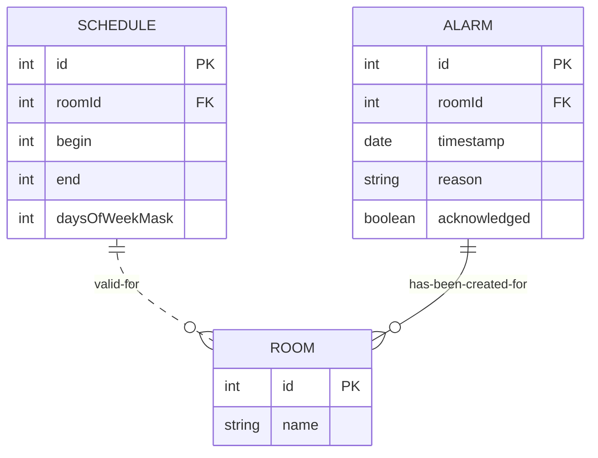
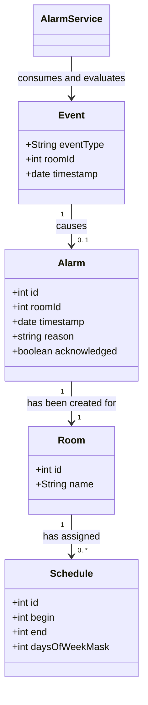
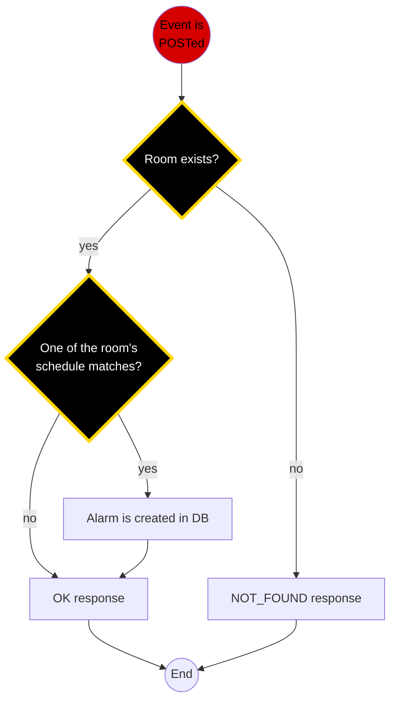

# Alarmservice
Example demo app

### Schedules
Schedules indicate whether or not to an alarm needs to be created in case of an incoming event.

```mermaid
gantt
    title Schedules
    dateFormat HH:mm
    
    section Room 1
        Schedule 1 : 00:00, 6h
        Schedule 2 : 22:00, 2h

    section Room 2
        Schedule 3 : 00:00, 8h
        Schedule 4 : 18:00, 6h
    
    section Room 3
        Schedule 4 : 08:00, 12h
    
    section ...
        ... : 00:00, 24h

    axisFormat %H:%M
```

### Entities
Our DB holds entries for __Schedules__, __Rooms__ and __Alarms__

# Class diagramm

### Flow

